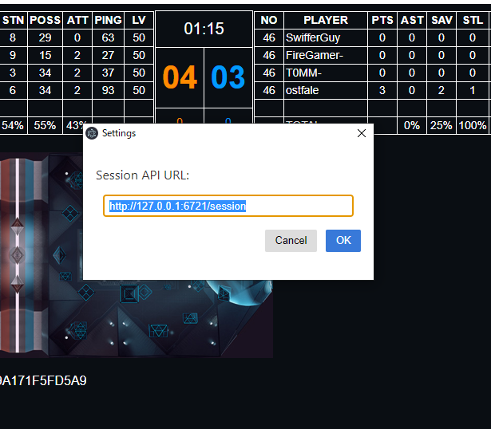

# EchoVR Session Panel
This tool is for EchoVR session API. By launching this tool, you can view the score of the current match and the stats of the players of the team. It is a green background because it is intended to be synthesized with OBS chroma key.


# Usage (PC edition)
Enable API in Settings of EchoVR.

Get `echovr-session-panel-win32-x64.zip` from [Releases tab](https://github.com/sifue/echovr-session-panel/releases) and Unzip.

Execute `echovr-session-panel.exe`.

# Usage (Quest2 edition)
Enable API in Settings of EchoVR.

Find Quest2 IP address(ex. `192.168.10.11`) with [IgniteBot](https://ignitevr.gg/ignitebot).


Get `echovr-session-panel-win32-x64.zip` from [Releases tab](https://github.com/sifue/echovr-session-panel/releases) and Unzip.

Execute `echovr-session-panel.exe`.

Configure IP Address(ex. `192.168.10.11`) of URL in Settings of Menu.



# API Document
Enable API in EchoVR.

See [https://github.com/Ajedi32/echovr_api_docs](https://github.com/Ajedi32/echovr_api_docs).

### Dev
Install Node.js (Upper v14.16.0). As follows.

```
npm i
npm start
```

### Build (Windows only)

```
npm install --save-dev @electron-forge/cli
npx electron-forge import
npm run make
```

Use `out\echovr-session-panel-win32-x64\echovr-session-panel.exe`

# LICENSE
MIT LICENSE
